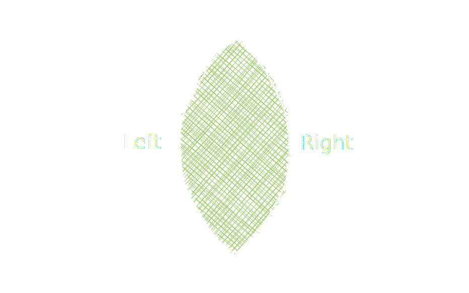
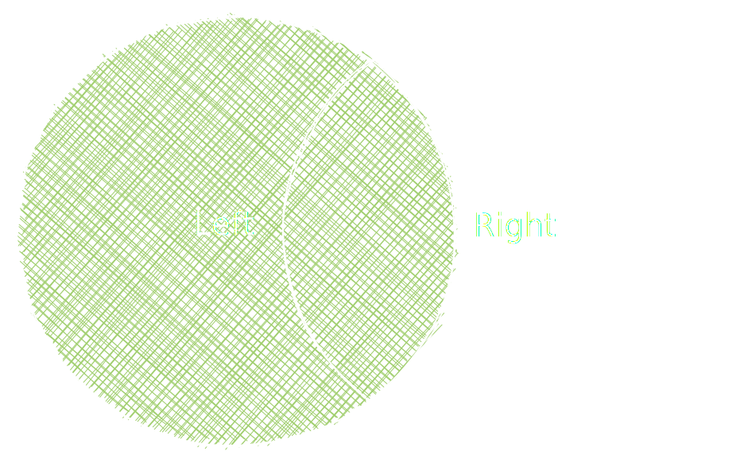
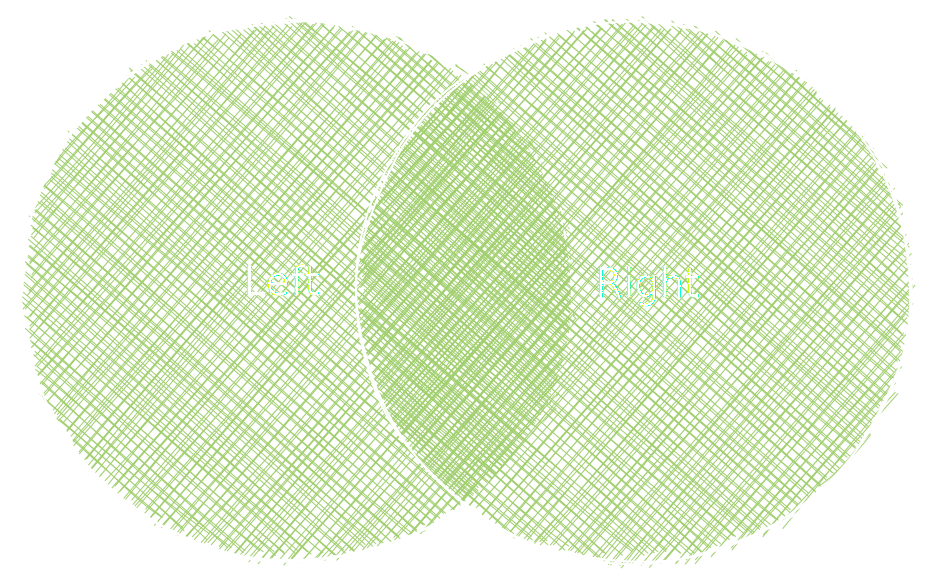

This guide discusses the set of join methods in Deephaven and their differences. There are several methods to choose from, and while the basic syntax is the same, this article will show you how to choose which join is right for your use case.

Frequently, related data is stored in two different tables, and you'd like to create a single table containing data from both data sources. Join methods allow you to do this. Each join method produces a different result, so it is important to know which produces your desired output. If more than two tables need to be joined, then the process can be repeated.

The following flowchart will help you choose which join is right for your use case.

import Image1 from '../assets/conceptual/joins3.svg';

<Image1 style={{height: 'auto', maxWidth: '100%'}} />

Are all of your match columns exact matches?

- When analyzing time series, it is common to join data immediately before or immediately after an event. Such inexact matches can be performed using the [`aj`](../reference/table-operations/join/aj.md)(As-of Join) and [`raj`](../reference/table-operations/join/raj.md)(Reverse As-of Join) methods. [`aj`](../reference/table-operations/join/aj.md) joins the closest data at or before an event. [`raj`](../reference/table-operations/join/raj.md) joins closest data at or after an event.

How should multiple exact matches be handled?

- [`exact_join`](../reference/table-operations/join/exact-join.md) raises an error.
- [`natural_join`](../reference/table-operations/join/natural-join.md) raises an error.

How should zero exact matches be handled?

- [`exact_join`](../reference/table-operations/join/exact-join.md) raises an error.
- [`natural_join`](../reference/table-operations/join/natural-join.md) joins null values.

Should all data from the left table appear in the result?

- [`join`](../reference/table-operations/join/join.md) only includes rows that have matching values in _both_ tables.
- [`left_outer_join`](../reference/table-operations/join/left-outer-join.md) includes all rows from the _left_ table. It only contains rows from the right table that match those in the left table.
- [`full_outer_join`](../reference/table-operations/join/full-outer-join.md) includes all rows from the _both_ tables. Null values are inserted where both tables don't have matching keys.

## Inexact match joins (time-series joins)

When analyzing time series, you may want to know values immediately before or immediately after an event. Inexact matches join these _approximate_ matches in the left and right table.

### As-of join

[`aj`](../reference/table-operations/join/aj.md) is used to join data from the right table immediately before or at the time of an event in the left table. If there is no matching key in the right table, appended row values are null. If there are multiple matches, only the closest match is returned.

### Reverse As-of join

[`raj`](../reference/table-operations/join/raj.md) is used to join data from the right table immediately after or at the time of an event in the left table. If there is no matching key in the right table, appended row values are null. If there are multiple matches, only the closest match is returned.

## Exact match joins

There are several methods to join when values are equal. They differ based on:

- if all rows from the left table are included,
- how multiple matches are handled, and
- how zero matches are handled.

### Exact join

[`exact_join`](../reference/table-operations/join/exact-join.md) joins on matching values from the right table. If there are zero matches or multiple matches, an error is raised.

```python order=left,right,result
from deephaven import new_table
from deephaven.column import string_col, int_col
from deephaven.constants import NULL_INT

left = new_table([
    string_col("Letter", ["A", "B", "C"]),
    int_col("Number", [5, 3, 2])
])

right = new_table([
    string_col("Letter", ["A", "B", "C", "D"]),
    int_col("Code", [10, NULL_INT, 16, 18])
])

result = left.exact_join(table =right, on=["Letter"])
```

### Natural join

[`natural_join`](../reference/table-operations/join/natural-join.md) joins on matching values from the right table. If there are no matches, joined values are null. If there are multiple matches, an error is raised.

[`natural_join`](../reference/table-operations/join/natural-join.md) is similar to [`exact_join`](../reference/table-operations/join/exact-join.md), but no matches results in a null value instead of an error.

```python order=left,right,result
from deephaven import new_table
from deephaven.column import string_col, int_col
from deephaven.constants import NULL_INT

left = new_table([
    string_col("Letter", ["A", "B", "C"]),
    int_col("Number", [5, 3, 2])
])

right = new_table([
    string_col("Letter", ["A", "B", "C", "D"]),
    int_col("Code", [10, NULL_INT, 16, 18])
])

result = left.natural_join(table=right, on=["Letter"])
```

## Join

[`join`](../reference/table-operations/join/join.md) performs an inner join and returns all possible combinations having matching records in both tables. Rows without matches in both tables do not occur in the result. Rows with multiple matches appear multiple times in the result. This join can be visualized by the venn diagram below.



The following example creates a `left` and `right` table, which are joined on the `Letter` column to show the result.

```python order=left,right,result
from deephaven import new_table
from deephaven.column import string_col, int_col
from deephaven.constants import NULL_INT

left = new_table([
    string_col("Letter", ["A", "B", "C"]),
    int_col("Number", [5, 3, 2])
])

right = new_table([
    string_col("Letter", ["A", "A", "B", "B", "D"]),
    int_col("Code", [10, 12, 14, NULL_INT, 16]),
])

result = left.join(table=right, on=["Letter"])
```

## Left outer join

[`left_outer_join`](../reference/table-operations/join/left-outer-join.md) returns a new table containing all rows from the left table as well as rows from the right table that have matching keys in the identifier column(s). A left outer join can be visualized by the venn diagram below.



If you want _all_ data from the left table, but _not_ all data from the right table, use [`left_outer_join`](../reference/table-operations/join/left-outer-join.md).

The following example performs a [left outer join](../reference/table-operations/join/left-outer-join.md) on two source tables.

```python order=left,right,result_left_joined
from deephaven.experimental.outer_joins import left_outer_join
from deephaven.column import string_col, int_col
from deephaven.constants import NULL_INT
from deephaven import new_table

left = new_table([
    string_col("Letter", ["A", "B", "C"]),
    int_col("Number", [5, 3, 2])
])

right = new_table([
    string_col("Letter", ["A", "B", "C", "D"]),
    int_col("Code", [10, NULL_INT, 16, 18])
])

result_left_joined = left_outer_join(l_table=left, r_table=right, on=["Letter"])
```

## Full outer join

[`full_outer_join`](../reference/table-operations/join/full-outer-join.md) returns a new table containing all rows from the left and right table without duplicates. Null values are put in place where data is missing from the left and right tables. A full outer join can be visualized by the venn diagram below.



If you want _all_ data from _both_ left and right tables, use [`full_outer_join`](../reference/table-operations/join/full-outer-join.md).

The following example performs a [full outer join](../reference/table-operations/join/full-outer-join.md) on two source tables.

```python order=left,right,result_full_joined
from deephaven.experimental.outer_joins import full_outer_join
from deephaven.column import string_col, int_col
from deephaven.constants import NULL_INT
from deephaven import new_table

left = new_table([
    string_col("Letter", ["A", "B", "C"]),
    int_col("Number", [5, 3, 2])
])

right = new_table([
    string_col("Letter", ["A", "B", "C", "D"]),
    int_col("Code", [10, NULL_INT, 16, 18])
])

result_full_joined = full_outer_join(l_table=left, r_table=right, on=["Letter"])
```

## Range join

[`range_join`](../reference/table-operations/join/range-join.md) returns a new table containing all rows and columns from the left table, plus additional columns containing aggregated data from the right table.

If you want to perform aggregations over a range of joined data, use [`range_join`](../reference/table-operations/join/range-join.md).

The following example performs a [range join](../reference/table-operations/join/range-join.md) on two source tables.

```python order=left,right,result_range_joined
from deephaven import empty_table
from deephaven.agg import group
from deephaven.table import Table

left = empty_table(20).update_view(["X=ii", "Y=X % 5", "LStartValue=ii / 0.5", "LEndValue=ii / 0.1"])
right = empty_table(20).update_view(["X=ii", "Y=X % 5", "RValue=ii / 0.25"])

result_range_joined = left.range_join(table=right, on=["Y", "LStartValue < RValue < LEndValue"], aggs=group("X"))
```

## Related documentation

- [Create a new table](../how-to-guides/new-table.md)
- [How to join two tables](../how-to-guides/join-two-tables.md)
- [As-of Join](../reference/table-operations/join/aj.md)
- [Exact Join](../reference/table-operations/join/exact-join.md)
- [Full Outer Join](../reference/table-operations/join/full-outer-join.md)
- [Join](../reference/table-operations/join/join.md)
- [Left Outer Join](../reference/table-operations/join/left-outer-join.md)
- [Natural Join](../reference/table-operations/join/natural-join.md)
- [Reverse As-of Join](../reference/table-operations/join/raj.md)
